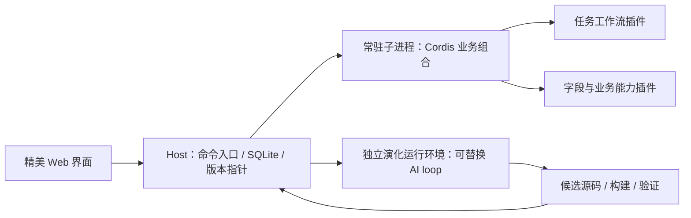

# 自迭代核心优先：当前实施基线 V2

日期：2026-09-06。依据：用户本轮明确调整。本文覆盖旧工程方案冲突内容；原 PRD 保留历史原文。当前目标是本地单所有者演示，不按完整平台交付。

## 1. 目标与判断标准

核心目标：同一个应用和同一批数据，能真实生成、验证、运行、继续修改和修复新的实现。优先级为有效迭代能力、运行及迭代性能、架构简洁与界面完成度。演示业务可以极少，视觉必须精致、有吸引力。

“最优雅”落实为：一次改动集中在一个模块；调用者只学习很小的接口；每个抽象有实际第二种实现证明必要。不给内部所有函数增加扩展钩子，不为尚不存在的适配器建包。

“性能最高”是优化目标，不能直接作为已实现结论。分别衡量任务命令 P95、候选生成/验证/切换时间、有效改进所消耗 token、连续迭代资源走势。模型耗时与本地执行分开；先建立基准，再优化占比最高的阶段。

## 2. 对旧方案的审查

| 旧设计                                          | 当前决定               | 原因                                                      |
| ----------------------------------------------- | ---------------------- | --------------------------------------------------------- |
| Todo 工作流、AI loop 可替换                     | 保留，优先验证         | 两者是自迭代核心，不以硬编码业务代替                      |
| 稳定插件身份、源码版本、活动组合                | 保留并精简             | 第二次修改必须找到第一次成果，重启后要继续存在            |
| 独立执行的验证与失败复现                        | 保留目标断言与基础回归 | 少测试但验证真实改进，避免“无异常”冒充修复                |
| 运行终止、上一个可用版本、任务保留              | 保留                   | 错误代码不能让系统永远失去继续修改能力                    |
| 每插件一个 Linux 容器、逐调用能力代理           | 删除当前要求           | 改为整个组合一个常驻子进程，插件内部直接调用              |
| 细粒度授权、审批哈希、多风险等级、CSRF/远程认证 | 不纳入当前演示         | 当前按本机使用；用户不需要学习审批治理系统                |
| 分布式租约、复杂发布状态机、客户端 ACK 门禁     | 删除                   | 单一数据写者、串行切换、事务性活动指针即可先验证          |
| 约二十张表、十余 packages、独立治理平台         | 不预建                 | 按真实存储需要增加；模块先共处一个工程                    |
| 完整 JSON UI DSL、通用 renderer 引擎            | 收缩为少数真实扩展插槽 | UI 壳直接用高质量 React 组件，动态字段/动作使用小描述结构 |
| 所有内容包括存储均可在线热换                    | 延后非核心实现替换     | 数据持久模块保持窄接口；没有需求不做运行中数据库迁移      |
| 原 42 项全部是第一版阻断条件                    | 改为分期参考           | 本版以第 7 节的核心演示验收为准                           |

取消安全平台建设不等于删除一致性。保护已完成的改进、区分真实通过与失败，属于核心产品行为。外部发布、多租户及恶意插件防护不在当前任务中。

## 3. 推荐架构

这里“一个组合一个进程”指稳定运行时的业务组合，不禁止候选验证期间启动第二个临时组合。演化工作与业务运行不能挤在同一个故障域，否则待修复业务卡死会阻塞修复工作。两种环境复用同一运行器实现，不建立逐插件 RPC 系统。

仅保留四个深模块：

- **Workspace**：`query / command` 隐藏持久化、任务修订和数据提交。生成流程返回决策，Workspace 负责提交。
- **Runtime**：`start / invoke / close` 隐藏 Cordis 状态、跨进程通信、超时和退出。插件之间仍消费 Cordis 服务。
- **Evolution**：`iterate / cancel / observe` 隐藏模型调用、相关上下文、候选构建和验证；loop 实现可替换，记录由外部保存。
- **Release**：`activate / restore` 隐藏候选就绪、串行切换、活动指针和兼容状态映射。

这四个名字是模块设计，暂不创建四套包、服务或网络端点。M0 使用 JavaScript 小实验和 Node 内建测试器，减少工具链变量。正式 UI/API 再引入 TypeScript、React/Vite；依赖在需要时固定。

推荐子进程的依据：进程内直接调用最快，但生成代码同步死循环会阻塞监督器；Worker 可终止 JS，却与宿主共享进程故障范围。常驻子进程多一次 IPC，能重建整个 ESM 模块图。本机小载荷 P95 约 0.133ms，比 Worker 多约 0.040ms；目前值得用这点开销换取简单的组合重启机制。详见一手研究与基准，不外推为生产指标。

## 4. 简化发布规则

候选使用独立运行环境执行目标用例；失败直接丢弃候选运行环境，保留源码和原因。通过后串行处理活动切换：等待正在执行的任务命令完成，启动候选，检查当前数据是否兼容，在一个 SQLite 事务里更新必要状态映射和活动版本，切换运行引用，再关闭旧环境。

重启只读数据库中的活动版本：事务未提交继续旧版，已提交启动新版。新版尚未真正可运行时不能标记发布成功。M0 只证明精确手写组合下的机制；生产化仍需不可变源码产物、启动失败恢复和副作用约束。

首期新增字段采用增量数据，不用整库快照回退。流程回退如需 review→open，显式提供完整映射并保留复盘文本。UI 按动作/表单契约展示，取消补充输入不改变任务。

## 5. 自迭代质量与性能

先做最小差异：读当前实现与接口，生成候选，验证，切换，观察。每次请求只涉及一个主要能力，避免全站重新生成。只有出现第二个真实需求才增加新的通用契约。

保留小而有效的验证：新增行为正例、边界反例、旧有任务操作、数据保留。自动修复必须先让旧版本复现失败，再让新版本通过相同断言。模型新增测试可以补充证据，不能单凭它自写自测认定正确。

记录生成、构建、验证、切换各自耗时以及真实 usage。稳定上下文前缀、按需加载相关接口、复用常驻进程值得优化；是否使用缓存、并行模型调用或多 Agent 搜索，依据真实耗时和成功率决定，不先构建调度平台。

## 6. 视觉与体验方向（2026-09-07 更新）

用户调整为 **Microsoft To Do 的极简风格：干净、克制，任务优先**。覆盖之前暖白青绿和灵动助手的设计方向。使用最新版 Tailwind CSS 与 Base UI 减少自定义交互成本，具体约束见根目录 DESIGN.md。

日常界面只保留任务列表、筛选、搜索、添加与详情。AI 是常驻可呼出的侧栏，不再是独立进化页面。版本和日志等周边信息收进二级入口，移除手写演示切换、示例数据和重复 M0 运行器，保留生产运行时回归及旧数据库兼容。

自然语言请求由服务端结合现有能力路由为任务操作、新建插件或修改插件，不以关键词硬编码假装模型理解。信息不足先追问。给用户的方案固定包含：需求理解、处理方式、具体改动、最终效果、数据影响。用户确认具体方案后才能执行，修改需求须重新生成并确认方案。

执行过程展示实际服务端阶段；可以收起继续处理任务，回来恢复状态。禁止定时器伪造进度、无证据的成功状态和未接入时的模拟方案。本轮交付 UI 与接口契约；真实路由、模型生成、持久化运行和候选发布进入 M2。

## 7. 重排后的里程碑

| 阶段              | 产物                                         | 验收                                                 |
| ----------------- | -------------------------------------------- | ---------------------------------------------------- |
| M0 核心实验，本轮 | Cordis、执行方式比较、流程替换、事务恢复     | 实测证据与失败边界，详见 m0-validation.md            |
| M1 精美可用切片   | 持久化 Todo + 动态动作 + 精致响应式界面      | 同一批任务可操作/刷新/重启；视觉浏览器审查通过       |
| M2 第一轮真实进化 | 输入“完成前写一句复盘”，真实生成插件并应用   | 候选源码、测试、版本与界面变化可核验，继续改同一插件 |
| M3 组合与修复     | 简单消费既有字段的第二插件，已知故障现场修复 | 能力复用；旧失败/新通过；重启与撤回保留数据          |

M0、M1 已有历史验收；2026-09-07 在 M2 前完成极简 UI 重构与演示代码删减。下一次开发直接进入 M2 的自然语言路由、方案确认和真实插件生成，不再增加手写演示功能。

## 8. 已知边界与后续决策

M1 历史报告已覆盖浏览器与 1000 任务负载；真实模型、长期内存和大消息性能仍未验证。进程冷启动样本很少，不能把它当可靠尾延迟。Node 内建 SQLite 在实验中使用，正式存储驱动在 M1 结合运行环境固定。

模型 provider/model 尚未配置，M1 不依赖它；M2 开始时再完成连接与能力探测。声明式插槽的表达范围用首个真实生成场景检验，避免为“任意 UI”提前设计语言。
