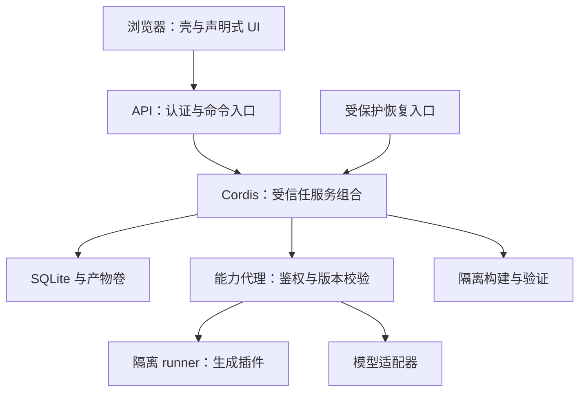

# 系统架构与插件契约

> 历史 V1 方案。当前采用 [V2 精简架构](00-core-direction-v2.md)，不再按本文完整容器、能力代理、通用 UI DSL 和多包设计实施。

> Agent 的最新范围、受保护策略、多文件候选与接口以 [Agent 重构详细设计](06-agent-redesign.md) 为准；本文 evolution-driver 替换不是应用内 Agent 的能力或本次验收要求。

状态：拟实施 v1。本文的 TypeScript 为设计草案，不是 Cordis 原生 API，也不是已编译的 SDK。

## 1. 运行边界



浏览器不接收模型密钥，不加载生成 JS。Cordis 宿主只加载维护者信任的系统插件与代理适配器。生成包由 runner 加载，宿主按经验证的 manifest 注册相应代理；同一 pluginId 的字段、服务、UI 和事件注册仍是一个生命周期单元。跨进程不是传递真实 `ctx`，而是带 Schema 的 JSON RPC。

默认系统插件也经统一 manifest/目录注册，但拥有维护者授予的信任等级。**一个公共插件协议、不同执行权限**，不是一套可组合插件加一套不可见的硬编码业务。

## 2. 建议目录（后续实现时创建）

| 路径 | 职责 |
| --- | --- |
| apps/web | React 壳、路由、草稿、动态动作与 UI renderer |
| apps/server | bootstrap、Hono 入口、恢复路径 |
| apps/runner | 固定可信启动器、隔离 JS 执行、RPC |
| packages/contracts | JSON Schema、TS 类型、协议版本、错误码 |
| packages/plugin-sdk | 生成代码允许消费的窄 API |
| packages/runtime-cordis | Cordis 适配、注册表、就绪与清理 |
| packages/system-plugins | tasks、workflow、fields、views、agent-driver、storage、model 等 |
| packages/governance | verifier、publisher、capability-broker、incident、recovery |
| packages/ui-kit | 字段、徽标、表单、令牌、可访问控件 |
| tests/baseline | 维护者保护的领域与跨插件回归 |
| tests/adversarial | 隔离、越权、资源耗尽、提示注入样例 |
| tests/e2e | 移动与桌面关键路径 |
| fixtures/demo | 非敏感任务与明示缺陷，不含隐藏修复补丁 |

生产生成源码放持久化产物库，不能直接写正在运行的仓库源码目录。开发仓库与应用内 PluginVersion 版本库是两个用途不同的仓库。

## 3. 系统提供者

| 提供者 | 公共能力 | 谁可替换、何时 |
| --- | --- | --- |
| task-repository.sqlite | TaskRepository v1 | 维护者，停写迁移后启动 |
| task-service | 命令入口、输入规范与查询 | 维护者兼容升级；生成插件不能绕过提交检查 |
| task-workflow.default | 状态/动作定义、transition 决策 | R2，排空短命令后替换 |
| task-ui.default | 默认列表/详情/操作描述 | 兼容页面协议内替换；不覆盖恢复 UI |
| field-registry / view-registry | 字段定义、查询描述、展示注册 | 服务实现为维护者范围；注册内容可以由普通插件扩展 |
| model-adapter | 结构化推理、工具回合、取消、usage | 维护者配置适配；业务插件调用受控代理 |
| evolution-driver.default | plan / generate / repair / checkpoint | 配置换兼容驱动；在途变更固定旧版或停止 |
| verifier / publisher / broker | 独立门禁、发布与能力权限 | 维护者维护，普通 Agent 无写权限 |
| incident / recovery | 归属、故障记录、最小恢复 | 受保护，业务插件不能卸载或遮挡 |

Task-service 负责“这次写是否合法与是否持久提交”，workflow 负责“这项业务动作应如何推进”。默认 open/done 规则不能散落在 task-service 或 UI。维护者可以更换系统服务实现，但不取消事务、授权和恢复不变量。

## 4. Manifest 草案

```json
{
  "schemaVersion": "1.0",
  "pluginId": "user.task-estimator",
  "versionId": "immutable-candidate-id",
  "sdkVersion": "1.0.0",
  "kind": "feature",
  "runtime": "isolated-js",
  "entry": "dist/index.js",
  "provides": [{"interface": "task-estimate", "version": "1.0.0", "schema": "schemas/estimate.json"}],
  "requires": [{"interface": "task-read", "range": "^1.0.0", "mode": "active-service"}],
  "fields": [{"key": "user.task-estimator.estimateMinutes", "type": "number", "optional": true, "unit": "minute"}],
  "subscriptions": [{"event": "task.created", "handler": "estimate"}],
  "ui": [{"slot": "task.row.badges", "descriptor": "ui/badge.json", "order": 100}],
  "permissions": ["tasks.read:title,description", "fields.write:own", "llm.invoke:estimate"],
  "limits": {"cpuMs": 1000, "memoryMiB": 128, "maxResultBytes": 65536}
}
```

这是结构示例，M0 后收敛为强 Schema：禁止未知顶层键，限制数组数量、嵌套深度和字符串长度；SDK 不从 manifest 自授权限。limits 是申请值，上限取部署策略、用户授权和 manifest 三者最小值。

`pluginId` 由系统分配并稳定保留；`versionId` 不可变。源码版本与可读 semver 分开；同一 semver 标签不能替换已有内容。摘要覆盖源码、构建、UI、Schema、配置、依赖锁与迁移计划。依赖按接口版本范围声明，发布前解析到 pluginId/versionId/hash 精确锁。主排序与工作流等独占能力要求显式选择提供者。

## 5. SDK 与领域协议

```ts
interface CallContext {
  operationId: string;
  traceId: string;
  compositionRevision: string;
  signal: AbortSignal; // runner 内的本地句柄；跨进程用 cancel 消息重建
}
interface WorkflowDriver {
  describe(): WorkflowDefinition;
  decide(input: WorkflowInput, ctx: CallContext): Promise<WorkflowDecision>;
}
type WorkflowDecision =
  | { kind: 'reject'; code: string; message: string }
  | { kind: 'input-required'; form: FormDescriptor; continuation: string }
  | { kind: 'commit'; nextState: string; patches: FieldPatch[] };
interface EvolutionDriver {
  plan(input: ChangeInput, tools: EvolutionTools): Promise<ChangePlan>;
  generate(input: CandidateInput, tools: EvolutionTools): Promise<CandidateRef>;
  repair(input: IncidentInput, tools: EvolutionTools): Promise<CandidateRef>;
}
```

生成代码只能返回决策或经 broker 调用批准能力。workflow 不接收 DB 连接；task-service 在短事务内复核 revision、动作、状态类别、字段权限及组合，再提交。等待用户填表或 LLM 时不持有事务/写锁。

`continuation` 由宿主签发短期、单次句柄，绑定 taskId/revision/workflowVersion/action/inputSchema；提交时重新校验全部绑定。它不是任意 JS continuation，更不是允许客户端指定跳转状态。

插件新服务的方法只支持 JSON 可序列化输入输出、Schema、错误码和异步调用。服务 A 调 B 时 broker 检查 A 的依赖与授权，保留调用链并限制深度；跨 RPC 不传对象引用或函数。服务定义可被目录发现，B 无需导入 A 实现。

## 6. 业务链路扩展规则

| 扩展点 | 输入输出与语义 | 组合与失败 |
| --- | --- | --- |
| command.register | 名称、Schema、动作元信息 | namespace 唯一，重名拒绝 |
| task.beforeCommit | 草稿、命令、不可变任务快照→validate/enrich/reject | `(order, pluginId, registrationId)` 稳定排序；串行；超时拒绝，不允许网络副作用 |
| fields.register | 类型/单位/隐私/默认值/控件 | 所有者唯一；新增可选；未知字段不静默抛弃 |
| task.created/updated/deleted | 已提交事实、changedPaths、revision、source | DB outbox 至少一次；订阅者幂等；观察者失败不撤销任务 |
| query.filter | 受控表达式 AST | 多选交集；空值规则显式；不接收 raw SQL |
| query.sort | 字段＋方向＋稳定 ID 次序 | 一个主排序提供者，冲突拒绝或明确选择 |
| ui.slot | Badge/Form/Menu/Panel 等描述 | 顺序稳定；每插件配额；失败显示替代态 |
| service.provide | 接口版本、方法 Schema、权限 | 依赖锁、单提供者或显式多注册表 |
| workflow.provide | 状态类别、动作、decide、兼容映射 | 独占；不可同时让两个流程处理同一命令 |
| schedule.register | 时间/时区/幂等键 | P0 在线进程任务；恢复后到期任务按声明 skip 或 run-once，不承诺系统推送 |
| diagnostics.annotate | 语义上下文，不覆盖宿主身份 | 限长、脱敏，不允许改真实 version/trace |
| lifecycle | activate→ready→quiesce→dispose | 所有订阅、RPC 与 job 登记；清理异常由宿主观察 |

项目实现自己的可排序注册表，再安装 Cordis 代理处理器。不能假设 Cordis 注册顺序天然等于 manifest 的业务优先级；也不把内存 emit 当持久事件队列。Cordis 的 `waterfall` 为 around middleware，不按数组 reduce 理解；事务前处理首期使用显式 pipeline 以减少歧义。

## 7. 能力目录

`capabilities.list/query` 返回 interfaceId、providerId、version、Schema hash、状态、方法、错误、权限、示例、成本、UI 容器和派发模式。状态分别列出 declared/installed/active/missing-dependency/unauthorized，不把已登记等同已可调用。

Agent 先读摘要再按需读 Schema、相关源码与回归。配置/生成输入包含 catalogHash 和 compositionRevision。manifest 自述不是实际能力证据；只有经过验证与激活的代理才能进入 active。缺依赖、循环、范围不兼容、独占冲突在发布前失败，不能永久 pending。

字段读取依赖区分 active-service 与 retained-field：后者引用持久化字段定义和读取授权，提供者停用后仍可读；是否继续显示由消费方声明。此差异必须在停用影响清单中可见。

## 8. 隔离实施设计

执行器以隔离容器为硬终止单位；每插件版本独立 runner，P0 同时运行数量设上限。生产、预览、测试各用不同能力句柄和数据空间。

- 非 root 用户、只读 rootfs、禁用网络、删除 Linux capabilities、no-new-privileges、seccomp；不挂宿主目录、密钥、生产 DB 或 Docker socket。
- 只挂单个已校验产物只读卷，临时文件放限额 tmpfs；CPU、内存、进程数、输出大小和总 wall time 有外部限制。
- 固定启动器通过 stdin/stdout 帧协议与 broker 通信；宿主按容器对应身份赋权，忽略插件自报 pluginId/role。日志走独立受限通道；伪造 RPC 也必须接受同等鉴权。
- worker/VM 可作为容器内实现细节，不作为外部权限边界。关闭网络不影响业务 LLM：runner 发 `llm.invoke` RPC，由 broker 检查用途、字段、预算再调用适配器。
- 普通插件无 shell/exec 权限；即便绕过 JS API 触及容器内 Node，也不能取得宿主能力。资源耗尽由外部 supervisor kill，撤销能力句柄及 lease。
- 构建器离线使用预装固定依赖；忽略生成包 scripts，拒绝任意安装命令、路径穿越、符号链接和越界产物。构建与测试同样不带生产密钥。
- 容器管理由单独受保护 runner-manager 执行固定命令，API 不暴露任意镜像、卷或启动参数。Docker daemon 本身是高权限面；不把 socket 交给生成代码。

这些是待 M0 对抗测试验证的控制项，不是已完成安全认证。部署环境无法提供隔离时，关闭自由代码路径；不自动降级到宿主 eval。

## 9. 声明式 UI 的表达边界

允许文本、徽标、数字/日期字段、选择器、表单、按钮、局部布局、可折叠面板与受限动效描述。`actionId` 映射已注册命令；数据绑定只读批准字段；文本按文本渲染，禁止 HTML/script/raw CSS/任意 URL。

允许生成新的受控动画描述（属性、关键帧、时长和令牌），由宿主约束次数、减少动态效果与静音；图标用可信目录，音效用已校验资源 ID。外部素材生成或任意自定义 React 为后续维护者扩展，不在 P0 暗中开放。

默认页面亦使用页面提供者描述数据与动作。基础可信 renderer 只负责交互和容器，不硬编码 open/done。用户代码不能修改全局导航安全出口、关闭恢复入口或覆盖确认按钮。
