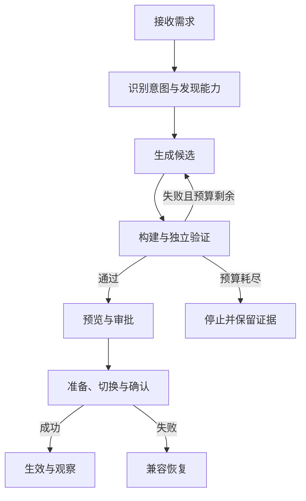

# 生成、发布与自修复

> 历史 V1 方案。当前采用 [V2 简化发布](00-core-direction-v2.md)，保留真实验证、版本与恢复，移除当前演示不需要的审批治理和客户端 ACK 门禁。

> 最新 Agent 流程见 [重构详细设计](06-agent-redesign.md)：先调查计划，用户开始后锁定需求，候选验证后单独确认应用；Agent 不修改自身策略。下文动态驱动、风险分级自动发布和复杂发布阶段仅保留历史参考。

状态：拟实施 v1。以下状态机由持久化执行器推进，不由 LLM 的自然语言成功声明推进。

## 1. 改造执行器

实际状态持久化为 received/clarification-required/authorization-required/planned/generating/building/validating/awaiting-approval/preparing/publishing/awaiting-client-ack/published；异常为 cancelled/failed/superseded/interrupted/recovering/recovered/manual-intervention。只能由合法边迁移；终态重新尝试建立关联变更，不擦除原失败。

默认最多 3 次候选、单调用 120 秒、单变更 10 分钟，均为可配置预算上限。跨重启保留已消耗量和 wall-clock 截止时间；等待用户审批不算生成执行时间，但审批有独立有效期。每个工具步骤保存输入摘要、输出引用和状态；重启不能把未完成工具当完成。

人工变更优先于修复；每工作区一个改造/发布写任务租约。普通 Todo 写入只在发布排空期间短暂停止，生成期间继续使用。取消请求在调用间检查，超时强杀隔离任务；提交不可分段时等待事务结束再给最终结果。

## 2. Agent 可以使用什么

| 工具 | 输入与输出 | 不能做什么 |
| --- | --- | --- |
| capabilities.list/query | 摘要与指定接口 Schema、示例、状态 | 不能把 declared 当 active |
| plugins.read | 指定 pluginId/versionId 的源码、manifest、依赖、测试 | 不能读取密钥或整个宿主目录 |
| change.plan | 目标、复用/新增决定、权限、验收、回退 | 不能修改真实审批记录 |
| candidate.write/patch | 当前候选内白名单相对路径与内容 | 路径穿越、宿主代码/基线测试修改被拒绝 |
| candidate.build | 候选摘要→固定构建报告 | 无任意 shell、依赖安装与生产凭据 |
| candidate.validate | 组合、基线、oracle→不可变测试报告 | 不能自报 pass 替代测试进程结果 |
| candidate.preview | 复制数据空间与 UI 描述 | 无生产写和正式通知 |
| incident.reproduce | 旧精确版本、最小输入、独立期望 | 无法复现不进入“验证修复”结论 |
| release.request | 请求发布符合门禁的候选 | 无 approval 时不能直接切换 |

默认 loop 按 plan→write→build→validate 推进，可由兼容驱动改变生成策略/工具顺序，但 broker 与发布器仍检查前置条件。替换驱动验收用第二个真实实现（例如更严格的先测试后修补驱动），不能只改显示名称。测试驱动可用桩验证契约，但真实生成演示必须用真实模型。

编码上下文按顺序包含受保护规则、SDK 版本、目录摘要、命中的契约、目标源码、相关基线、脱敏样例。任务正文、日志、插件文档作为数据区提供，不能授予工具权限。最终授权由宿主绑定，不依赖 prompt 防注入是否成功。

业务 LLM 与编码 LLM 的用途、预算、数据授权分别记录。结构化响应经过 Schema 验证，工具参数重复校验；provider/model 支持不足时显示模型能力缺口，不无限修补业务代码。

## 3. 候选与独立验证

候选不可变快照包含 source、bundle、sourceMap、manifest、UI、field Schema、依赖锁、配置、权限差异、状态映射、测试与回退计划。继续修改产生新 candidateId/hash，原审批失效。

| 阶段 | 执行证据 | 发布门槛 |
| --- | --- | --- |
| 静态 | TS 类型、入口、允许依赖、构建器/SDK/hash | 编译成功且来源闭合 |
| 契约 | Schema、字段所有权、依赖锁、循环/独占检查 | 无缺失/冲突/未授权调用 |
| 功能 | 独立输入与期望、候选测试 | 满足需求的可观察行为 |
| 基线 | 基础 Todo、数据一致性、流程 | 保护基线全部通过 |
| 组合 | 受影响依赖闭包＋当前组合 | A/B 插件同时工作、无重复能力 |
| 生命周期 | 激活、排空、20 次替换、资源计数 | 无重复监听、重复 job、持续活动资源积累 |
| 浏览器 | 320/390 核心路径及受影响 UI | 可预览、批准、操作、回退 |
| 修复 | old fail / new pass / unchanged baseline | 原错误真正复现；功能断言不削弱 |

测试报告由可信验证器写入并包含测试定义 hash、fixture hash、环境、SDK、精确组合与执行时间；生成代码不能写报告存储。候选测试可由 AI 新增，但不得覆盖保护性 oracle。新功能验收由结构化需求与维护者基线确定，不能只依赖同一个模型自己写的测试。

预览启动完整候选组合，在复制数据上运行。默认模型用显式标注的桩；若预览调用真实模型，单独授权数据与预算，并清楚标记。预览外部副作用全部禁用或映射到测试记录。

## 4. 审批绑定

审批对象是不可变的：candidateHash＋baseCompositionId＋grantHash＋migrationHash＋testReportHash＋SDK/protocolVersion＋有效期。权限、产物、测试、基线、映射任一变化使审批失效。

R0 配置：主动请求、允许令牌范围、无新权限，可通过系统记录的低风险策略自动应用；仍需校验/版本/撤回。R1 新增代码默认人工批准；只有显式开启同权限低风险修复自动发布时，可由策略签发审批。R2 工作流、数据语义、新权限必须人工确认。治理变更走维护者代码发布，不走普通生成。

可见预览不是审批；点击方案“开始”也不是对未知最终产物授权。审批在数据库切换事务内消费，重复请求按 publicationId 幂等返回。

## 5. 发布协议：有持久记录的切换

P0 不使用开发 HMR 直接替换生产源码。产物不可变，新 runner/描述预准备；Cordis 负责代理生命周期，发布器负责 DB、权限租约与客户端的一致性。

1. **落盘**：构建产物先写临时文件、校验 hash、fsync 后原子 rename 到内容地址，再写 DB 引用；崩溃留下的无引用文件由 GC 清理。不得 DB 指向半个 bundle。
2. **预准备**：解析新组合、检查当前壳协议、启动新 runner，注册到非活动目录；预览/自检只能访问复制数据。真实生产任务与模型副作用尚未开放。
3. **获取发布锁**：再次验证基线、审批和测试摘要。持久化 publication PREPARED，阻止新任务命令进入；已进行的短命令排空。未决长 job 取消并撤销 lease，不等 LLM 网络返回。
4. **排空与冻结**：停旧生产订阅入口，等待正在提交的事务结束。旧可执行 runner 终止、能力句柄撤销；旧可信代理 await dispose 并核查资源。清理失败则不进入切换；若无法保证唯一写入者，保持只读恢复而非强启新版。
5. **切换事务**：`BEGIN IMMEDIATE` 内确认 active==base、锁归属/epoch、审批未过期未消费，执行已批准兼容映射，写 compositions、active 指针、递增 epoch、publication SWITCHED、消费审批和 outbox。任何失败全部回滚。
6. **激活**：将候选代理置 active，以新 epoch 签发生产能力，启用订阅；关键探针通过后恢复业务写入。所有持久写请求都核对 epoch，迟到旧 RPC 拒绝。
7. **客户端确认**：发送 composition.changed；操作客户端拉新描述、保留草稿、完成握手和最小 UI 检查并 ACK。成功后 publication CONFIRMED；其他离线客户端以后握手，不阻塞全部用户页面。
8. **清理**：淘汰预览环境与旧无效资源，保留旧产物和 lastKnownGood 引用。记录真实停写时间，不把构建耗时算作停写。

准备阶段不能把复制数据测试结果等同生产激活；切换后的关键探针在开放新业务写前执行。若这些探针失败，在写入仍冻结时应用迁移日志对应的补偿事务并恢复旧组合；这仅撤销发布自身的数据映射，不覆盖业务快照。

一旦新版本已接受业务写入，回退改用“基于当前数据的新迁移计划”；无法安全映射则只读恢复并提示确认。不得利用自动回退覆盖发布后新任务或人工值。

## 6. 崩溃与客户端失败处理

| 崩溃/失败点 | 启动或恢复动作 |
| --- | --- |
| 产物落盘但 DB 未引用 | 保留旧组合；无引用文件延迟 GC |
| PREPARED、未 SWITCHED | DB active 为旧版；撤销暂存 runner，按旧组合重建，解除租约 |
| 已停旧但未提交 | 重启旧版并恢复订阅；在途 job 租约失效后按幂等规则重试 |
| SWITCHED 后新 runner 未就绪 | 默认冻结写入；重建精确新版本并验证，失败按迁移日志补偿或进入恢复 |
| 新版已开放写入后进程崩溃 | 从 DB active 重建新组合；不可自动把旧全量快照还原 |
| 客户端离线/ACK 超时 | 状态为服务端已生效、待客户端确认；不把网络问题当代码缺陷，不因无 ACK 盲目回退 |
| 客户端明确新描述无法渲染 | 创建精确版本故障；兼容时恢复组合，否则保留草稿进入可信恢复 UI |
| 旧客户端发命令 | COMPOSITION_STALE；无写入，重新握手 |
| 候选必要插件无法激活 | 写入开放前恢复全部旧组合；不能保留半套新版本 |

启动时新建 runtimeEpoch，旧进程的内存身份无效；读取 publication 和 DB 指针作决定，不猜最后一次对话进度。受保护 recovery 页使用独立静态资源，支持导出、禁用用户插件、按已验证的兼容组合恢复；数据状态不兼容时只读，不强制默认 open/done。

## 7. 自修复协议

采集由宿主代理强制绑定 pluginId/versionId/bundleHash/compositionRevision/operationId/traceId、阶段、错误码和必要 source map。渲染边界、异步命令、RPC、runner 退出、超时、清理分别采集；插件追加的 annotation 不可覆盖真实身份。

故障 fingerprint 由插件身份、稳定错误类型、归一化源码位置/语义断言组成；版本用于归属，repairFamilyId 用于跨候选累计尝试。5 分钟窗口只负责聚合，不重置同家族的 3 次上限。候选验证失败记录在变更内部，不触发新的生产修复。

处理顺序：分类→聚合→确定归属→最小复现→固定 oracle→隔离候选生成→旧版失败/新版通过→保护回归→审批→发布→观察。状态区分 reproduced/unreproduced/mitigated/verified-fixed/unresolved。

不改代码的情况：校验错误、取消、拒绝权限、网络断开、429/超时与模型配置不支持。数据完整性/越权立即阻止行为，不自动发布。验证器/发布器/采集器故障转维护者处理。

自动修复设置分为本地采集、允许脱敏诊断/候选、允许同权限低风险发布三个开关，默认只开采集。没有独立预期的“可能算错了”先请求一个能确定正确行为的例子；不凭模型自信制造修复成功。

## 8. 真实演示的证据包

每次演示保存模型 route、生成调用 ID/usage、请求与候选关联、源代码 diff、旧/新 bundleHash、保护测试 hash、测试结果、批准与 publicationId。非敏感原始输入可保留，密钥永不入包。

建议缺陷：筛选插件把缺估时转换成 0，错误纳入“20 分钟内”。先明示启用缺陷版，fixture 包含缺值、unknown、20、21、人工 15；保护 oracle 要求仅 20 与人工 15 纳入。旧版必须失败、现场生成的修复必须通过，同时保留其他筛选回归。返回空数组会在正例断言失败，不能算修复。

缺陷版、fixture 和触发脚本可预置；修复补丁不能隐藏预置。演示失败保留真实日志，使用恢复入口展示系统仍可用，不切换假成功结果。
