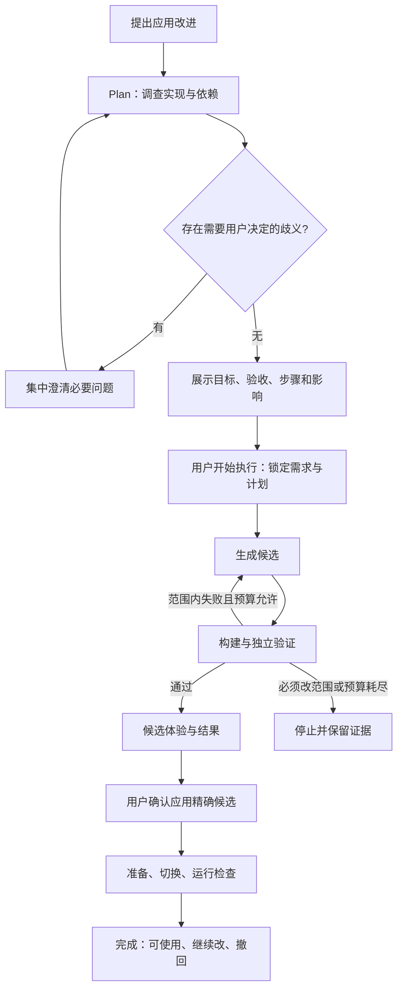

# 自迭代 Agent 重构详细设计

日期：2026-09-07。状态：调查、执行进度、候选体验（隔离探针）与绑定式 apply 已有公开命令与测试验收；体验为临时 Runtime 探针而非完整独立数据平面；持续迭代已提供绑定发布版本的 continue、独立业务验收修订确认和旧版故障复现门槛；恢复主线已落地提交前/提交后补偿、重启对账、保留数据撤回与 A12/A13 公开验收（浏览器侧含恢复入口契约；完整故障注入仍以 app 测试为主）。

本文是当前 Agent 重构的实施依据，覆盖原 PRD、V1 工程方案和 V2 中冲突的 Agent 职责、执行策略可修改性、确认流程与生成范围。其他未冲突的本地单所有者、四个深模块、数据保留和极简界面约束继续有效。决策依据见 [ADR 0001](../adr/0001-evolution-scope-and-application-confirmation.md)、[ADR 0002](../adr/0002-protect-independent-evolution-controls.md)、[ADR 0003](../adr/0003-complete-capability-gaps-within-one-change.md)、[ADR 0004](../adr/0004-freeze-request-and-show-execution-progress.md)；术语见 [CONTEXT.md](../../CONTEXT.md)。

## 1. 目标与非目标

Agent 唯一职责是把对本应用的改进需求推进到可验证、可体验、可应用和可继续修改的实现。它可以解释本次变更及其状态，但不承担通用问答或普通任务操作。日常 Todo 通过现有界面完成，模型不可用不影响基础业务。

本次交付是 Agent 重构，不是开发闹钟。具体功能的行为取舍由重构后的 Agent 在 Plan 阶段调查、澄清和冻结；不得将任何一个示例功能的字段、动作或测试写死在通用执行循环中。

范围包括需求沟通、调查规划、多文件候选、独立验证、范围内修正、候选体验、两次明确用户操作、应用与恢复、继续迭代和进度视图。保留现有框架及依赖，不引入多 Agent 调度平台、插件市场、多租户、远程部署或任意依赖安装。

Agent 不修改自己的执行策略。改造循环、工具权限、预算、取消、验证结果记录、系统保护测试、发布事务与恢复入口由维护者持有。普通自迭代不能修改或通过别名、依赖、配置和入口替换绕过它们。

## 2. 当前实现的具体问题

| 位置 | 已核对的事实 | 重构要求 |
| --- | --- | --- |
| `src/server/evolution-domain.ts` | 规划限制为 complete 时收集文本；目标是字段长度规则；能力上下文只有当前工作流 | 改为行为目标和按需能力发现，字段验收保留为业务案例 |
| `src/evolution/evolution.ts` | Plan 单次调用；执行工具只有读契约、读当前源码、提交单文件；验证后立即 apply | Plan 工具循环；多文件候选；验证后停在待应用状态 |
| `src/shared/assistant.ts` | 包含 task 路由，confirm 只绑定计划；没有候选确认 | 删除普通任务执行路由；区分 start 与 apply |
| `src/release/types.ts`、`src/release/release.ts` | 版本和构建围绕单一源码、单一服务，切换前调用 describe | 版本扩展为完整应用组合产物，业务专有探针由契约提供 |
| `src/server/workspace.ts` | 当前活动版本绑定工作流；同时承担业务和持久提交 | 把可变业务和受保护提交职责划清，保留唯一数据写者 |
| `src/web/useAssistant.ts` | 只观察最新运行；轮询持久状态 | 支持按 runId 恢复进度及历史，不用聊天文本重建运行 |
| `src/web/AssistantPanel.tsx` | 混合路由方案和执行显示 | 需求沟通、计划、进度、候选结果形成明确视图 |

这些是静态核对结果，不是本轮真实模型验收。现有幂等操作、候选尝试记录、独立子进程、版本留存和旧数据兼容可以复用；不能把扩大提示词范围当作完整重构。

## 3. 用户主流程

“开始执行”允许在冻结范围内生成、验证和修正，不授权正式应用。“确认应用”绑定已验证候选，不授权事后替换源码或扩大行为。需要额外数据外发、付费或外部副作用授权时提前说明，已有授权不重复索取。

需求明确时也必须先调查，再展示计划。技术事实由 Agent 自行查明；只问目标歧义、影响用户使用的取舍和范围变化。不使用关键词表代替需求理解。对普通任务操作只指向现有入口；对无关问答简短说明职责，不启动变更。

## 4. Plan 的输出与执行前门槛

Plan 是有预算的只读工具循环，可以读取当前版本、相关文件、接口、测试和诊断，并在隔离环境运行既有检查；不能写正式数据、修改实现或触发外部副作用。调查不读取整个任务库，不读取密钥；默认用合成样例，真实任务按必要范围及授权取用。

每个计划必须包含：

| 内容 | 要求 |
| --- | --- |
| 目标与范围 | 用户可观察的结果、明确不包含的事项、来源需求修订 |
| 调查证据 | 已读的精确实现版本、接口、相关测试及环境检查结果 |
| 能力差异 | 可复用能力、需修改或新增能力、依赖与保护范围交叉检查 |
| 行为验收 | 正例、边界反例、已有行为保留、数据及生命周期要求 |
| 执行步骤 | 每步目的、依赖、预期产物、完成证据；不是任意 shell 清单 |
| 数据影响 | 新增状态或字段、兼容策略、当前数据适用性和撤回方式 |
| 验证与体验 | 目标如何测、使用何种固定检查器、用户如何体验候选 |
| 应用方式 | 组合切换、是否重启业务运行、可预期中断和恢复条件 |
| 预算及未决项 | 剩余调用和候选预算、已知限制、确需用户决策的问题 |

存在未解决的行为歧义、已知阻断依赖、无法执行的验收或未授权副作用时，不进入 ready。未知项不能全部写成“实现时再看”。Plan 不能保证执行永不失败，但必须把能提前查清的问题前置。

模型提出计划，执行器验证必填项、读取证据引用、基础版本、可写范围及检查器可用性后，才允许用户开始。展示计划是短摘要，可展开证据；不向普通用户暴露无关内部类型和文件布局。

## 5. 职责与可修改范围

继续使用四个深模块，不拆成多个项目或服务平台：

| Module | Interface 与职责 |
| --- | --- |
| Workspace | `query / command`：业务数据、唯一持久提交、公开业务契约；业务语义由可变实现决定 |
| Runtime | `start / invoke / close`：组合加载、执行、超时和清理；生成代码故障不阻断 Evolution |
| Evolution | `command / observe / close`：固定 Plan/执行循环、模型调用、工具授权、预算、需求记录和事件 |
| Release | `prepare / activate / restore`：产物验证、候选体验环境、串行切换、提交事实和恢复 |

在现有工程内分离“可变应用实现”和“受保护控制实现”，不靠整个 src 目录白名单粗放授权：

- 可变：业务插件、业务 React 页面、业务接口和必要的运行能力提供者。业务能力通过 Cordis 组合复用；允许一次变更跨多个相关文件。
- 受保护：Evolution 固定策略、模型凭据与工具执行入口、进程监督、数据库提交控制、验证器及系统保护断言、发布恢复、改进入口的开始/停止/应用控件与状态来源。
- 边界：可以新增业务契约，不能修改控制接口。可以变更数据的业务解释与兼容映射，不能绕过持久写入、丢弃数据或替换数据库驱动。可以增加业务运行能力，不能撤销超时、取消或隔离限制。

现有混合文件先由本次维护者工程重构拆出职责，再开放可变部分；不能让应用内 Agent 修改 workspace.ts 整个文件以绕过提交保护。路径策略、解析后的依赖和实际工具能力均由受保护执行器检查。当前正则导入扫描和 Node 子进程不是强安全沙箱，不得声称能够防御任意恶意代码。

## 6. 候选形式与工具

候选工作副本从已发布的完整应用源码产物建立，不直接编辑开发者当前 checkout，也不覆盖正在使用的静态资源。复用现有 TypeScript、React/Vite、Cordis 和锁定依赖。固定构建入口不执行模型提供的 package scripts；不允许修改依赖锁来引入任意安装行为。

能力目录由活动组合生成，提供能力身份、提供者精确版本、接口、依赖、实际就绪状态及相关源码/验收引用。不能把 manifest 声明等同于实际可用。只读摘要后按需取得详细材料。

内部工具按阶段开放，名称为拟实施契约，不是现有 API：

| 阶段 | 工具 | 返回与限制 |
| --- | --- | --- |
| Plan | `inspect_application`、`read_source`、`read_contract`、`read_acceptance` | 版本绑定的内容与引用，按范围读取 |
| Plan | `check_environment`、`run_existing_check` | 固定检查目录内的检查；合成或授权副本，无任意命令 |
| Plan | `propose_plan`、`request_clarification` | 执行器验证结构并记录；模型不能授权自己 |
| 执行 | `read_candidate`、`patch_candidate` | 限当前候选可变文件；规范化路径，拒绝越界及符号链接绕过 |
| 执行 | `build_candidate`、`validate_candidate` | 固定构建与可信检查器执行，返回诊断及证据引用 |
| 执行 | `prepare_preview` | 精确候选、隔离数据、无正式副作用 |
| 执行 | `report_blocker` | 记录障碍，执行器决定状态，不自动扩大范围 |

不提供模型可调用的正式任务写入或 release.apply 工具。apply 只由用户命令触发，经 Release 复查执行。工具参数均校验，未知工具拒绝；任务内容、源码注释及日志作为数据，不授予权限。

首次 build 将当前工作副本封存为一个不可变 candidate；修改后产生新 candidateId，原产物和失败报告保留。业务配置变化也产生版本，无需强迫生成无意义代码。新增插件由宿主分配稳定身份，后续修改沿用身份；一个变更可以包含多个协作插件及业务界面。

## 7. 状态与外部命令

状态迁移由服务端控制，模型文本不直接作为状态：

| 状态 | 允许的用户操作 | 退出依据 |
| --- | --- | --- |
| planning | 查看、停止；修改需等调查停止 | 调查证据、问题或有效计划 |
| awaiting-input | 回答、修改需求、取消 | 新需求修订后重新调查 |
| awaiting-acceptance | 比较旧、新规则及原因、确认修订、修改、取消 | confirm-acceptance 绑定 planId 与 revisionId，确认后进入 ready |
| ready | 查看计划、修改、开始、取消 | 精确 planId 和基础版本校验 |
| executing | 查看、停止；禁止修改及另起执行 | 候选通过、阻塞、失败或取消 |
| awaiting-apply | 体验、应用、放弃、调整后重新规划 | 精确候选与验收摘要确认 |
| applying | 查看、请求停止 | 提交前可停止；提交后以事实为准 |
| succeeded | 查看结果、继续改、撤回 | 终态，新改进创建关联运行 |
| blocked / failed / interrupted / cancelled | 查看证据、以原需求重新规划 | 终态，不静默恢复模型执行 |

executing 内部阶段为生成、构建、验收、修正、准备体验；一个固定步骤可以多次尝试。改变步骤状态必须对应工具开始/结束事件，不能因为进入下一步就把上一步全部标为成功。

公开命令：request、answer、revise、confirm-acceptance、start、cancel、experience、apply、continue。continue 绑定父 runId 和当前已发布 baseVersion，保留父运行的诊断与预算事实；成功运行仅可继续其仍在使用的精确发布版本。修复请求使用 intent: repair，模型识别为修复时也触发旧版检查；无法复现断言失败时以 unreproduced 阻塞。start 绑定 runId、planId；apply 额外绑定 candidateId、evidenceHash、compositionRevision。revise 仅在等待用户的可编辑状态可用，执行期间返回 REQUEST_LOCKED，服务端强制拒绝，不能只禁用输入框。所有写命令带 operationId，同 ID 同输入返回原回执，同 ID 不同输入拒绝。

observe 支持 runId 和事件游标，默认返回最新运行。保留 `/api/assistant` 和 `/api/assistant/commands` 作为入口，增加按运行查询及事件增量参数；不因内部重构建立第二套 API。旧 confirm 不得在新流程中被解释成应用授权。

单工作区最多一个未结束变更，等待输入、开始或应用时仍占用该位置；可放弃后重建，不建设队列。普通 Todo 在调查、构建、体验时继续可用；应用排空期间短暂停写。

## 8. 运行记录与预算

复用当前 SQLite，按实际需要增量扩展 evolution_runs、evolution_operations、evolution_calls、evolution_candidates；增加事件和独立验收修订的持久记录，不预建通用工作流数据库。

| 记录 | 必需身份与内容 |
| --- | --- |
| Run | runId、parentRunId、requestRevision、baseComposition、policyVersion、状态、计划引用、预算 |
| Plan | planId、需求摘要与 hash、步骤、验收修订、可写范围、调查引用、数据及应用方式 |
| Candidate | candidateId、planId、基础版本、完整文件摘要、构建输出、依赖锁、契约版本、配置与映射 |
| Evidence | candidateId、检查定义 hash、fixture hash、环境、结果及失败诊断；验证器写入 |
| Event | runId、递增 sequence、stepId、attempt、开始/结束时间、结果、证据引用 |
| Application receipt | operationId、候选与确认摘要、前后组合、提交结果、就绪检查结果 |

需求补充保存结构化历史，不只把新文本拼到旧字符串后；继续修改读取已发布版本及历史验收，不读取“最近一次聊天”猜测基础版本。

默认沿用每次运行 12 次模型调用、3 个封存候选、10 分钟活动执行预算。Plan 调查也计入调用和活动时间，等待用户不计时；进入 ready 时展示剩余预算。范围内修正不得重置预算，无新证据的同类失败可提前停止。预算由维护者配置，Agent 不得自行调大；人工开启的新运行保留关联失败记录，不自动创建新 run 绕过上限。

持久化调用开始、结束、失败与真实 usage。无法取得 usage 显示未知，不按耗时推算 token。模型网络错误不自动归因成业务代码缺陷，不静默换模型或无限重试。

## 9. 独立验收与业务规则修订

三种证据必须分开：系统保护回归、冻结的业务验收、模型补充自测。保护测试及检查器从可信控制版本载入，不从候选提供的同名路径载入；报告由验证进程写入，候选只能得到诊断。

业务验收在 Plan 中表达为 Given/When/Then，并绑定明确的可观察结果。为避免建立新的万能测试 DSL，优先用现有命令/查询契约的输入与结果断言、固定浏览器操作及可见状态断言、固定生命周期检查。由可信检查器解释数据化案例；应用代码候选不能改变已冻结案例。

模型可以提出案例，但不能仅凭自己生成实现和自测报告认定正确。开始前用户能看到业务目标与验收，系统保留已有回归；新类型行为没有可靠检查器时，应在 Plan 阶段揭示并补齐维护者验证能力，不能以自由生成的测试脚本冒充独立 oracle。

用户主动改变既有业务要求时，展示旧规则与替代规则并确认，建立新验收修订。旧版本记录保留；系统保护约束不随业务需求变化。执行开始后禁止修改已冻结断言，失败必须修改候选而不是改期望。

修复类请求必须绑定故障版本，先复现旧版失败再验证新版通过相同案例，并通过其他保护回归；无法复现记录为 blocked/unreproduced，不输出“已修复”。本次不建设无人值守故障自动发布策略。

## 10. 体验、应用与恢复

可变应用产物包含后端业务组合和前端业务资源，受保护控制进程持有模型、数据库提交、版本指针及恢复入口。普通业务变更通过替换业务组合和资源生效；所谓需要宿主扩展，优先在可变业务提供者和公开业务契约层完成。若确实要求改变控制进程协议或保护实现，Plan 明确转维护者升级，不把它隐藏在业务补丁中。

复用同一 Runtime 实现分别启动活动组合与临时候选组合；两者数据空间和副作用能力不同。体验环境默认使用合成数据，无生产 DB 或模型密钥；用户授权的数据副本可按需使用。体验行为不写正式任务、不发送正式通知，页面明确标注候选；有依赖外部交付的功能必须另有真实交付证据，不能把模拟结果冒充验证通过。

应用采用一个受保护的活动组合指针，包含精确业务代码与前端资源版本。前端资源使用不可变路径，旧页面请求携带组合修订，过期写入拒绝并要求刷新，不能让旧 UI 用旧字段语义写入新版本。不增加客户端 ACK 发布门禁。

应用步骤：

1. 用户确认候选、验收报告及影响摘要；校验候选未变、基础组合有效、保护规则未变。
2. 预启动精确候选业务组合，执行契约指定的就绪检查；重新检查当前数据兼容，不使用 Plan 时的数据快照直接提交。
3. 串行排空业务写入，在同一 SQLite 事务提交必要兼容映射、完整活动组合指针、发布记录和操作回执。
4. 更新服务引用，执行无外部副作用的运行检查，开放业务写入；记录真正就绪后才展示完成。前端发现组合变化加载对应资源，保留草稿。
5. 关闭旧组合，登记清理结果。业务资源的启动/清理失败不得使 Evolution 和恢复入口不可用。

文件产物先完整落盘再写引用。事务前失败维持旧版；事务提交后响应丢失按回执查询，不再次发布。若提交后尚未开放写入即启动检查失败，可按预先验证的补偿恢复旧组合；数据库记录必须反映已恢复，不把曾提交等同于仍可用。若已接受新业务写入，撤回使用当前数据的兼容检查与映射，不恢复整库快照。

启动按数据库提交事实恢复组合；planning/executing 的未完成运行标记 interrupted，不自动续调模型。ready/awaiting-apply 保留，用户操作时重查版本和产物；applying 必须核对发布事实及运行状态，不能统一当失败重做。

取消在工具间检查并终止活动子进程；发布事务前阻止提交。事务已提交时不能声称取消成功，继续核对就绪或恢复事实。停止后新执行重新 Plan，不能直接应用旧候选。构建与验证子进程必须有可验证的文件、凭据和进程权限约束；未通过保护测试不得开放扩大后的写入与执行能力。

## 11. 进度与交互设计

保留现有 To Do 布局和常驻小按钮，入口文案为“改进应用”，输入提示为“描述希望应用增加或改变的能力”。侧栏负责需求沟通和计划查看；开始后切换为专门进度视图，桌面允许离开继续操作 Todo，手机使用全屏视图。

计划卡依次展示目标、最终效果、验收、步骤、数据与应用影响，提供开始、调整、取消。进度视图展示计划步骤、当前阶段、实际检查结果、失败与第几次修正、已用预算；日志和源码差异折叠。执行期间无需求输入框，不增加后台排队入口，保留停止。

轮询先沿用现有方式，但按 runId 和 sequence 合并真实事件；只观察不推进。刷新、关闭侧栏或网络中断不能新建运行，显示最近状态及连接中断，不捏造进展。stepId 保持稳定，attempt 独立，失败尝试不会被后续成功抹掉。

候选卡明确“尚未应用”，展示目标达成、验收结果、体验入口、变化及数据影响，提供应用、调整后重新规划、放弃。成功卡必须关联版本及回执，提供去体验、继续改、撤回。无可交互界面的变更展示真实结果或诊断证据，不强制伪造页面预览。

保护的控制 UI 与可变业务 UI 分开，生成业务页面不能遮挡停止、确认和恢复。沿用现有字体、Base UI 焦点与无障碍方式，检查 320px 重排、键盘和输入法，不重做其他页面视觉。

## 12. 迁移与实施顺序

| 主线 | 修改集中点 | 退出条件 |
| --- | --- | --- |
| 调查到开始 | `evolution.ts`、`evolution-domain.ts`、`assistant.ts` 与共享契约 | 普通问答/任务命令不执行；Plan 有证据和验收；开始绑定计划；执行期间后端拒绝改需求 |
| 候选到应用 | `release/*`、`runtime/*`、Workspace 的业务/提交分离 | 多文件业务组合可构建、独立验证、体验；未确认不应用；确认绑定精确候选；保护项不可改 |
| 持续使用与恢复 | 进度视图、`useAssistant.ts`、持久事件、生命周期测试 | 刷新恢复、范围内修正、继续修改、取消、提交断点与撤回均有证据 |

三条主线是完整重构的交付路径，不是三种可择一结束的结果。实现细节遵循现有目录，不预建层层 Adapter；测试通过与调用者相同的公开 Interface 验证。

旧数据库增量迁移，保留任务、字段、版本和运行记录。旧单工作流版本可由内部适配读取为只有一个提供者的组合；新候选统一使用完整产物协议，不长期并存两套 Agent 循环。旧 awaiting-confirmation 不能直接变成新 start 或 apply 确认，标记需要重新 Plan；旧已完成发布保留事实。旧 task 路由停止提供，但历史记录仍能读取。

模型连接沿用现有 Gemini Driver，仍仅负责模型调用，不引入可自修改的 Loop 插件或为了证明策略替换而增加第二实现。重构后的控制策略版本只用于诊断和维护者升级兼容。

## 13. 验收矩阵

以下均为待运行要求，不是通过记录。场景输入可以固定以便复现，但实现必须由真实模型生成；桩仅用于控制流、故障注入和稳定回归。

| ID | 场景 | 必须观察到 |
| --- | --- | --- |
| A01 | 问答、普通任务操作、应用改进三类输入 | 只有改进启动迭代；其他输入不写任务或版本 |
| A02 | 缺少用户行为预期 | 集中必要澄清，技术事实由工具查明；未明确不开始 |
| A03 | 已知缺依赖或需改保护部分 | Plan 提前发现并显示阻塞，不先承诺可执行 |
| A04 | 点击开始、重复请求及执行中 revise | 正确计划只启动一次；revise 被服务端拒绝且冻结内容不变 |
| A05 | 构建或业务断言失败 | 真实诊断进入修正，旧失败保留；断言不变，预算不重置 |
| A06 | 候选通过但用户未应用 | 正式版本和任务不变，体验在独立空间进行 |
| A07 | 候选/报告被改或基础版本变化 | 旧确认不能应用；明确过期并重新 Plan |
| A08 | 非文本工作流类型的需求 | 真实发现、修改相关业务文件/接口、验证与体验；不依靠预置功能答案 |
| A09 | 继续修改既有能力 | 稳定身份、基于真实已发布版本，保留旧功能和数据 |
| A10 | 尝试修改策略、保护测试、构建入口或绕过路径 | 工具和运行约束拒绝；不能通过自报报告绕过 |
| A11 | 离开、刷新、断网重连 | 同 runId 恢复，顺序和尝试记录正确，无假进度或重复执行 |
| A12 | 各阶段停止与服务重启 | 无迟到发布；提交前后正确区分，已提交结果按事实恢复 |
| A13 | 新组合启动失败、成功后撤回 | 无半套资源生效；撤回保留期间新增任务与字段 |
| A14 | 用户明确修订业务规则 | 旧/新规则可见且留痕，系统保护断言不变，执行中不改验收 |
| A15 | 故障修复请求 | 旧版失败、新版相同案例通过；不能复现则如实停止 |

至少覆盖两种结构不同的真实模型需求，其中一类超出现有 complete 文本字段契约，并验证同一能力的继续修改；还要证明既有能力与新能力可同时工作。业务示例只作为测试，不能变成产品范围承诺。真实模型调用必须保存需求/计划、工具、源码差异、候选、验收、确认和应用回执的关联证据。

按仓库脚本执行 `pnpm typecheck`、`pnpm test`、`pnpm build`、`pnpm test:e2e`，再运行明确标注的真实模型验收与构建产物启动检查。报告区分控制流桩、真实模型生成、浏览器体验和恢复证据；未运行不能记为通过。

完成标准：用户能通过一个稳定的 Agent 调查并实现不同类型的应用改进，在明确的开始与应用操作之间看到真实进展，失败可停止和恢复，改进可继续迭代。提示词更积极、计划更完整或单一示例通过均不足以单独交付。
