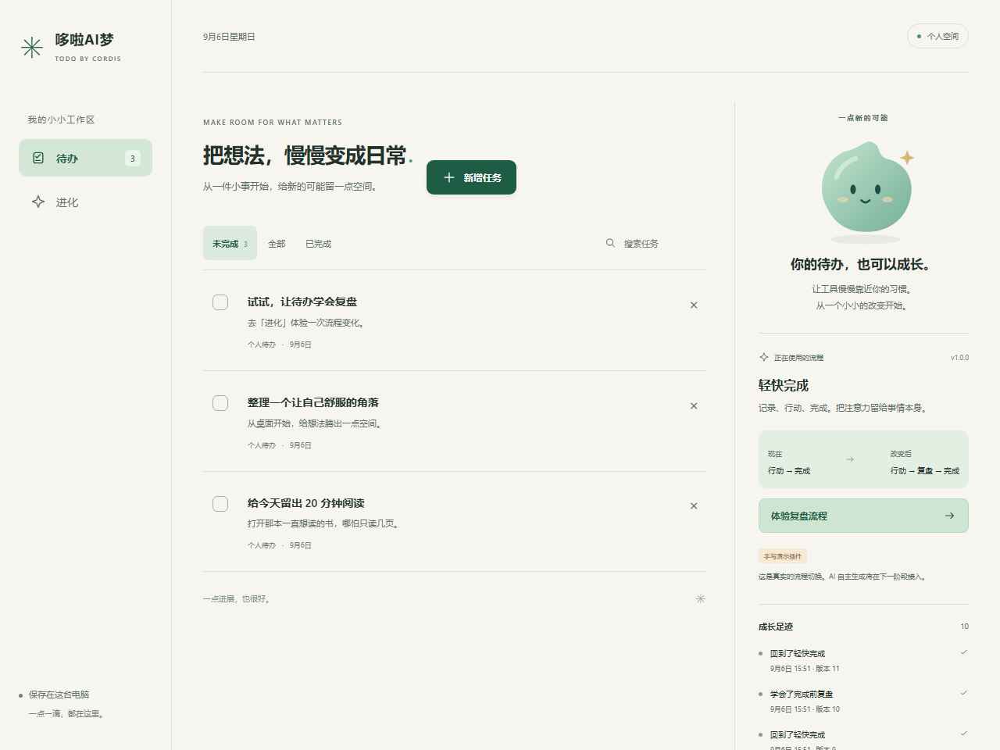

# M1 验收与演示

日期：2026-09-06。状态：本机 M1 通过；真实移动设备与远程 CI 尚未执行。依据用户确认的 M1 计划与 V2 核心优先原则。

## 已交付

- 明亮暖白、青绿色的双区界面，原创 SVG 助手提供待机、工作、成功、失败状态。桌面同时查看任务与进化，手机使用待办/进化导航。
- 新增、编辑、完成、重新打开、搜索、筛选、分页、软删除与撤销；任务和复盘数据持久化。
- 两个分别实现的 Cordis 工作流插件：默认完成、完成前补充复盘。表单由插件描述驱动，取消不写任务，切回默认流程后文本仍可查看。
- 真实候选预启动、目标行为验证、版本切换记录与构建摘要。手写来源明确展示，没有模型调用或虚假生成进度。
- 独立子进程运行、超时终止、一次自动重启与人工重试；宿主持有唯一数据库提交路径。
- SQLite 四类存储：tasks、operations、workspace、releases。写操作与幂等结果同事务；任务修订、组合修订和输入校验在提交前复核。
- CI 配置、开发/生产启动、类型检查、领域/运行测试、浏览器测试与独立基准脚本。

## 运行与演示

Node 24.18.0，pnpm 11.21.0。首次 `pnpm install --frozen-lockfile`，随后 `pnpm build`、`pnpm start`，访问 http://127.0.0.1:4517 。浏览器依赖通过 `pnpm exec playwright install chromium` 安装。

1. 在空列表手动新增，或主动载入三条示例。
2. 点击任务正文编辑；点击状态方框完成；在“已完成”重新打开。
3. 在进化区域点击“体验复盘流程”，观察当前流程和历史真实变化。
4. 再完成同一条任务，填写一句复盘。先取消一次，确认任务未完成；再次进入时输入仍在。
5. 提交复盘，在已完成任务详情查看文本。
6. 点击“恢复轻快完成”，刷新页面，确认任务与复盘保留。
7. 正常停止和重新启动服务，确认同一数据继续存在。

默认数据库为 `.runtime/workspace.db`，通过 `DATABASE_PATH` 指定其他位置。默认服务端口 4517，避免本机 Windows 保留的 4314–4413 范围。使用 `PORT` 更换端口。未开放公网，也未自动部署。

## 自动化证据

| 检查 | 结果 | 覆盖 |
| --- | --- | --- |
| `pnpm typecheck` | 通过 | 正式 TypeScript/React 代码 |
| `pnpm build` | 通过 | 服务端编译与 Vite 生产包 |
| `pnpm test` | 25 通过，0 失败 | 15 项 M0 + 10 项 M1 |
| `pnpm test:e2e` | 7 通过，0 失败 | Chromium 153.0.8010.12、Playwright 1.63.0 |
| `pnpm bench:m1` | 达到本机目标 | 1000 条任务、真实 HTTP、生产构建、20 次切换 |

M1 领域/运行测试具体覆盖：相同操作重放、不同输入拒绝复用、空标题、旧修订冲突、删除撤销、复盘补充输入与取消、发布重试、版本过期、人工字段与重启保留、候选失败、分页/字面量搜索、HTTP 丢响应后查询操作结果、20 次自动释放旧进程、一次自动重启及人工恢复、三个实际进程退出窗口、无限 JS 超时终止。

崩溃点为候选已准备、数据库事务中、切换已提交。重开数据库核对活动版本和原任务；不是只在内存里抛异常。20 次切换测试等待旧进程自行退出，随后检查进程不存在，不借测试里的 close 掩盖产品清理遗漏。

浏览器在 320、390、768、1280 四种宽度各执行完整任务链路：新增、完成、重新打开、切换、取消复盘与草稿恢复、提交、撤回、编辑、刷新、删除与撤销；检查无全页水平溢出与页面 JS 异常。

其他浏览器用例覆盖：网络保存失败保留草稿、切页与流程变化保留输入、中文 composition 期间 Enter 不误提交、真实服务器成功但响应丢失后重试只生成一条任务、提交成功但列表读取失败仍关闭已保存表单、键盘进入详情和关闭后焦点返回、44px 手机状态操作区、减少动态效果。

首次测试发现并修正了幂等结果中 undefined 字段与 JSON 重放不一致的问题；末轮复查修正了保存成功后列表刷新失败可能诱发重复创建的问题。最终结果为修正后的真实运行记录。

## 性能

原始数据：[m1-benchmark.json](m1-benchmark.json)。Windows 10.0.26200，AMD Ryzen 7 8845H，Node 24.18.0。1000 条持久任务；读取每页 100 条；200 次预热后分别测量 1000 次串行 HTTP 查询和编辑，包含解析响应。无模型耗时。

| 指标 | 实测 | 目标 |
| --- | --- | --- |
| 查询 P95 | 17.82ms | ≤50ms |
| 写入 P95 | 17.67ms | ≤50ms |
| 切换停写 P95 / 最大值 | 1.58ms / 1.82ms | ≤300ms |
| 候选准备 P95 | 145.11ms | 单独记录 |

性能是本机顺序负载结果，不代表公网、多用户或真实模型吞吐。候选启动和检查在停写段之外。没有为了截图伪造性能数值。

最终前端包约 211kB JS、15.2kB CSS；gzip 约 67.2kB、4.0kB。没有远程字体、3D 或大型 UI 框架依赖。

## 视觉证据

实际浏览器截图均保存在 [m1-screenshots](m1-screenshots/)，并已人工视觉检查四种宽度。

另包含空态、四种宽度的进化与任务页面。截图数据来自独立浏览器测试数据库，个人默认工作区保持空白；桌面概览中的历史是真实测试产生的切换记录。

## 工程边界与下一步

Workspace 集中数据提交与发布切换的串行段，Runtime 隐藏子进程/Cordis 细节；两个工作流分别实现相同接口。发布操作保持在 Workspace 的持久化边界内，没有拆出额外网络服务。前端将编辑、动作表单、进化面板、助手和图标分别组织，保留小而明确的组件接口。

当前只加载两个随应用构建的固定版本，不具备自由源码上传、动态构建、不可变产物库、真实 AI loop 或自动代码修复。M2 应增加候选源码与构建器、模型连接及真实验证执行，再接入已有动作/表单/切换路径。M1 的两个夹具不能包装为 AI 已完成生成。

未执行：真实 iPhone/Android、屏幕阅读器人工检查、Linux 实测、远程 GitHub Actions 运行、长期内存压力。CI 文件已建立，本机执行的对应检查通过；不把未运行的远程流水线计作成功。
